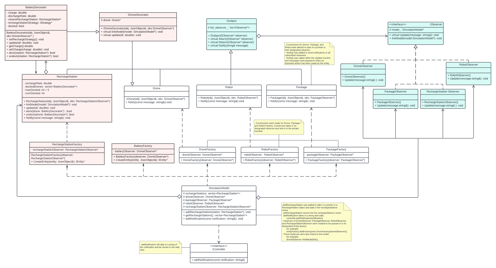

# Drone Delivery Simulation

  
### Pull from DockerHub 

Download the Docker image from this link: https://hub.docker.com/repository/docker/michaeloberpriller/drone_sim/general


### Running the Simulation
  Compile the project with
  ```bash
    make -j
  ```
  Run the simulation with
  ```bash
    make run
  ```
  or
  ```bash
    ./build/bin/transit_service 8081 apps/transit_service/web/
  ```
  Now the simulation visualization can be viewd at http://127.0.0.1:8081.  
  The page for delivery scheduling is available at http://127.0.0.1:8081/schedule.html.

### Simulation Features
The simulation features the movement of entities around the UMN campus. These entities include drones, packages, robots, humans, recharge stations, batteries, and helicopers. The main feature is the simulation of a drone delivery system. When a delivery is scheduled. A drone will move towards the delivery's package. It will then pick up the package and head towards the robot at the end destination. The drone will use the movement strategy specified by the delivery. The helicopter and human entities will randomly move around the simulation.  
  
The simulation featues a web user interface to interact with the simulation. There is a 3D simulation visualization page that has a 3D viewer of the UMN campus. This page allows the user to move the view the mouse or arrow keys, zoom in or out, and change the entity within the simulation to focus on. The user can also show/hide all of the simulation's routes, stop the simulation, or view the schedule page. There is also a notification bar that displays important information from the simulation.  
  
The schedule page allows user to create a new delivery for the simulation. The user can enter a name, search strategy, and use the map to choose the start and end locations of the delivery. This page shows all previous and in progress deliveries with their names, start and end coordinates. The user can also add a human to the simulation.

## Project Extensions



### Battery Decorator
This extension adds a battery to the drone entities, and recharge station. When a drone is flying, it now constantly drains energy from the drone's battery. If a drone runs out of battery, it can no longer move. A drone can recharge its battery by docking at a recharge sttaion. At a full charge, a drone will operate normally, but if the battery has less than 20% charge, the drone will head to the nearest recharge station.  
  
We used the decorator design pattern to implement this extension, We incorporated the drone's new behavior, the battery, by encapsulating the drone within a battery wrapper object, since it is adding new functionality to the drones while still using the old functionality.
  
This extension is not directly interactable, but by scheduling many deliveries the drone's movement to a recharging station can be observed. Updates to a drone's battery percentage can be viewed in the notification bar. New drones with batteries can be created in the umn.json file with the "battery" type.

### Notifications
This extension adds a notification bar that displays important information from the simulation. This includes when a package is picked up, when a package is deliveried, battery percentage updates, and recharge station docking and undocking.
  
We used the observer pattern for this extension, since each entity could be implemented as a subject and observers could be created to monitor events from each of their relevant entities.

This extension can be viewed on the 3D visualization page. After scheduling deliveries, notifications from relevant entities will appear within the notification bar on the left side of the page.

## Sprint Retrospective

In this project, we used the Agile approach to manage our tasks. We followed the Scrum method, dividing our work into fixed-time periods called "sprints." Before each sprint, we listed the tasks in a backlog, such as getting an idea approved, adding a charge station feature, and showing battery levels on the frontend.

During the sprint, we had meeting and assigned tasks to team members and daily communicated with teammates via GroupMe. Agile helped us be more flexible, collaborate better, and work faster. It encouraged open communication, teamwork, and accountability among team members.

In our successful sprint, we achieved goals, delivered high-quality work, communicated well, and collaborated effectively. However, we faced challenges too, like a bug while working on the battery decorator, causing delays. We adjusted our timeline, communicated with the team to finish the task.


## Youtube Presentation
Below is a link to a video describing our simulation. In this video, we discuss the UML diagram and the extensions we implemented, and we demo the simulation.
https://youtu.be/6YZLSh_lb2w
